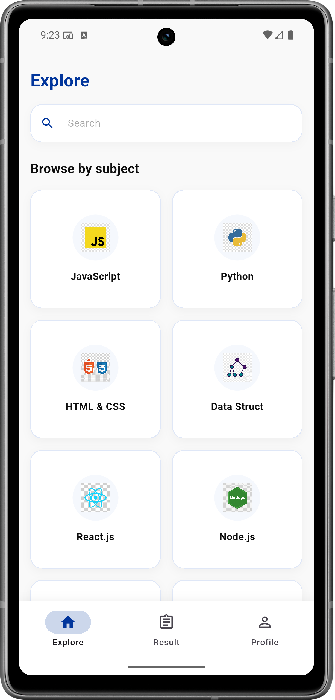
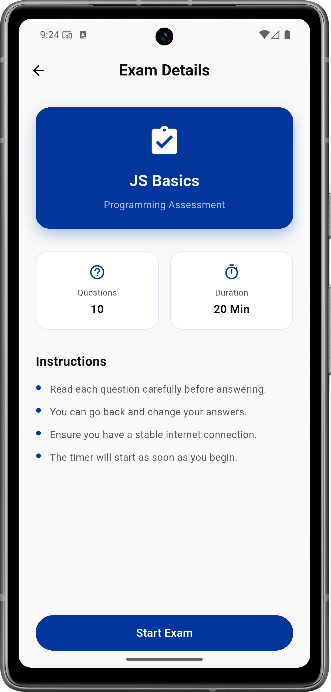
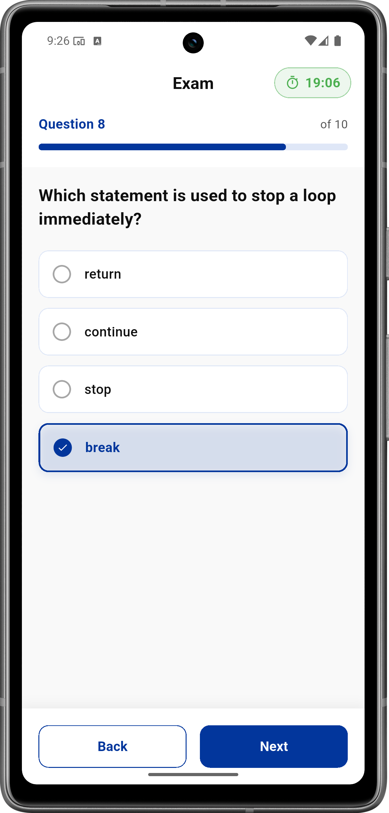
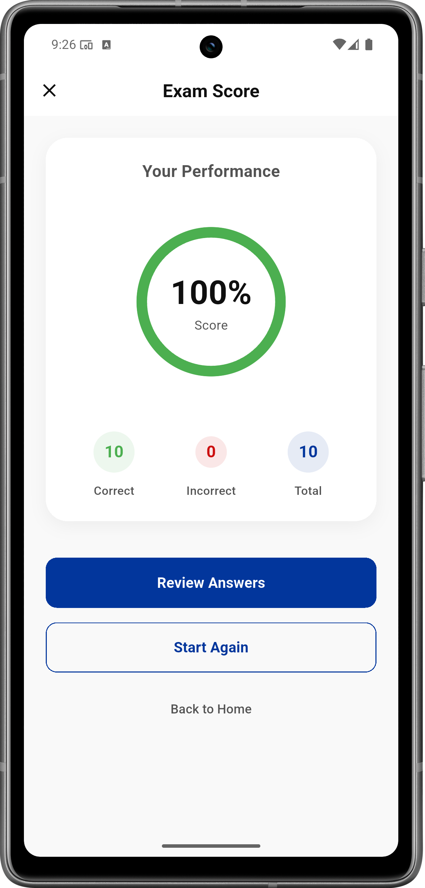
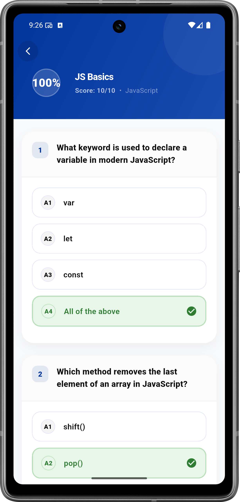

# Exam App

<p align="center">
  
</p>

<p align="center">
  A polished Flutter exam-preparation app with authentication, subject browsing, timed quizzes, score tracking, saved results, and profile management.
</p>

---

## Overview

**Exam App** is a Flutter application built with a clean, feature-first architecture. It lets users sign in, browse exam subjects, view exam details, take timed tests, review their scores, and manage their profile and password from one place.

The app uses:
- **Flutter / Dart** for the UI
- **Bloc / Cubit** for state management
- **GetIt + Injectable** for dependency injection
- **Dio + Retrofit** for networking
- **Hive** for local exam-history storage
- **Flutter Secure Storage** for authentication tokens
- **Custom reusable widgets** for a consistent UI

---

## Features

- Authentication flow: login, register, forgot password, verification, and reset password
- Explore page with searchable subject cards
- Subject exam details screen with instructions and exam metadata
- Timed exam experience with multiple-choice questions
- Score screen with performance summary
- Saved results screen with grouped exam history
- Detailed exam review screen
- Profile screen with editable personal data
- Change password flow
- Error page for invalid or missing routes

---

## Screenshots

<p align="center">
  
  
  
</p>

<p align="center">
  
  
  
</p>


---

## Project Structure

```text
lib/
├── config/
│   ├── base_response/
│   ├── di/
│   └── dio/
├── core/
│   ├── constant/
│   ├── presentation/error_page/
│   ├── storage/
│   ├── theme_manager.dart
│   └── utils/
│       ├── router/
│       └── widgets/
└── feature/
    ├── auth/
    │   ├── login/
    │   ├── register/
    │   └── forget_password/
    ├── exam/
    │   ├── api/
    │   ├── data/
    │   ├── domain/
    │   └── presentation/
    ├── exam_subject/
    │   ├── api/
    │   ├── data/
    │   ├── domain/
    │   └── presentation/
    ├── explore/
    │   ├── api/
    │   ├── data/
    │   ├── domain/
    │   └── presentation/
    ├── profile/
    │   ├── api/
    │   ├── data/
    │   ├── domain/
    │   └── presentation/
    ├── profile_change_password/
    │   ├── api/
    │   ├── data/
    │   ├── domain/
    │   └── presentation/
    └── results/
        ├── api/
        ├── data/
        ├── domain/
        └── presentation/
```

### Architecture notes

- Each feature is split into **API**, **data**, **domain**, and **presentation** layers.
- Shared app concerns live inside `core/`.
- Dependency injection is configured in `config/di/`.
- Routing is centralized in `core/utils/router/`.

---

## Main App Flow

1. The app initializes Hive storage and dependency injection.
2. It checks whether a saved token exists in secure storage.
3. If a token is found, the user is sent to **Explore**.
4. Otherwise, the app opens the **Login** screen.
5. From Explore, users can browse subjects, start exams, and review results.

---

## Key Packages

- `flutter_bloc`
- `get_it`
- `injectable`
- `dio`
- `retrofit`
- `flutter_secure_storage`
- `hive` / `hive_ce`
- `cached_network_image`
- `fl_chart`
- `intl`
- `equatable`

---

## Getting Started

### Prerequisites

- Flutter SDK
- Dart SDK
- Android Studio, VS Code, or another Flutter-compatible editor
- An Android emulator or physical device

### Installation

```bash
git clone <your-repo-url>
cd exam_app
flutter pub get
```

### Run the app

```bash
flutter run
```

### Generate code when needed

If you change injectable, retrofit, or json_serializable files:

```bash
flutter pub run build_runner build --delete-conflicting-outputs
```

---

## Assets

- `assets/icon/exam.png` — app launcher icon
- `assets/images/alarm.png`
- `assets/images/sand_clock.png`

---
